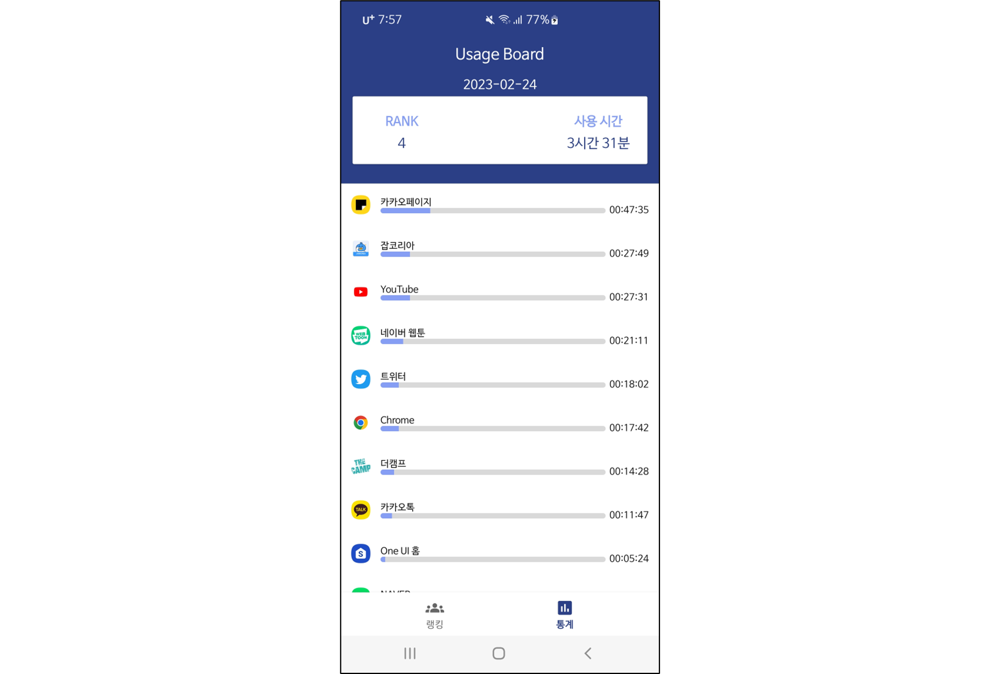
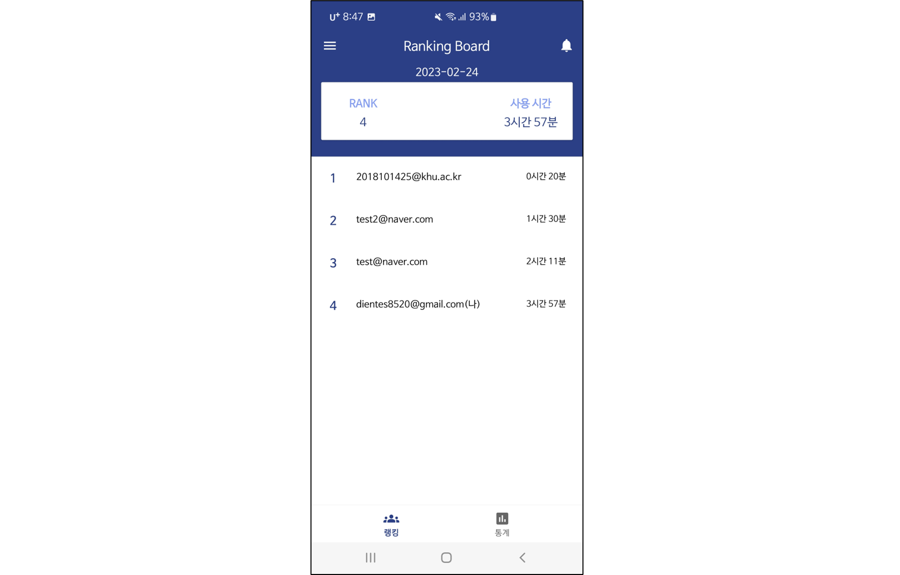
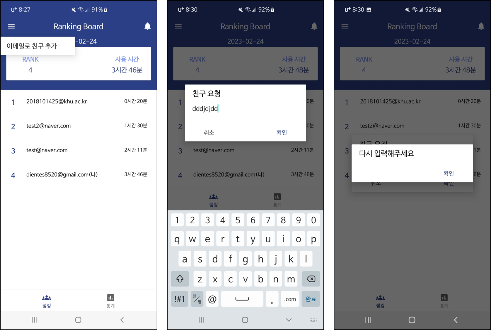
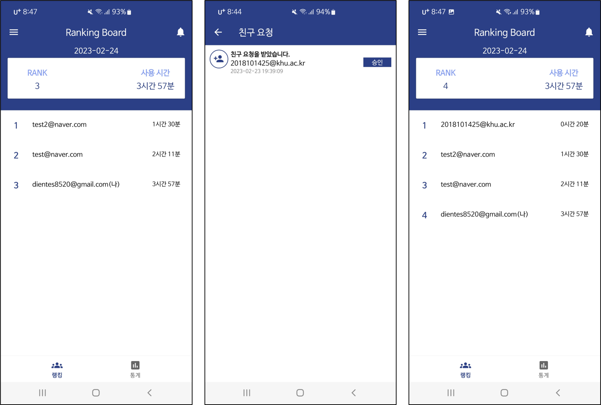

# 📴About

- 친구들과 함께하는 스마트폰 중독 방지 앱
- 개인 프로젝트
- 개발 기간: 2022.10 ~ 2023.02(진행 중)

# 💬Summary

- 스크린 디톡스는 과도한 스크린 타임을 줄이기 위한 앱입니다. 이전에도 스크린 타임을 줄이기 위해 수많은 방법을 시도해 봤습니다. 가장 효과가 좋았던 방법은 친구들과 함께 사용 시간을 줄이는 것이었습니다. 
- 스크린 디톡스는 사용자가 친구들과 서로 스마트폰 사용 시간을 비교하며 스마트폰 사용을 줄이도록 유도합니다.
- [Screen Detox 개선 과정](https://github.com/hamcoding9/ScreenDetox-v2/wiki/Screen-Detox-%EA%B0%9C%EC%84%A0-%EA%B3%BC%EC%A0%95): 스크린 디톡스는 첫 완성 이후 버전2로 개선 과정을 거쳤습니다. Ver2에서 달라진 점을 Wiki에 담았습니다.

# 🛠️Tech Stack

- 언어: `Kotlin`
- 서버: `Firebase(Auth, Realtime database)`
- 아키텍처: `MVVM`
- 비동기: `Coroutines`
- JetPack: `AAC` `LiveData` `ViewModel` `Navigation` `DataBinding`
- 버전 관리: `Git`
- 디자인: `Figma`

# 📱Features

### 스마트폰 사용 통계

- 통계 탭에서 나의 스마트폰 사용 통계를 확인할 수 있습니다.

### 스마트폰 사용 랭킹

- 랭킹 탭에서 친구의 스마트폰 사용 시간 순위를 확인할 수 있습니다.

### 친구 추가/친구 승인

- 랭킹 탭에서 친구 추가 버튼을 눌러 친구를 추가할 수 있습니다.

- 랭킹 탭에서 알림 버튼을 눌러 나에게 온 친구 요청을 확인할 수 있습니다. 승인 버튼을 누르면 친구가 되어 랭킹 탭에서 친구의 스마트폰 사용 시간을 볼 수 있습니다.

- 앞으로 친구 요청이 오면 아이콘이 바뀌거나 서버에서 알림을 전송하는 기능을 추가할 예정입니다.