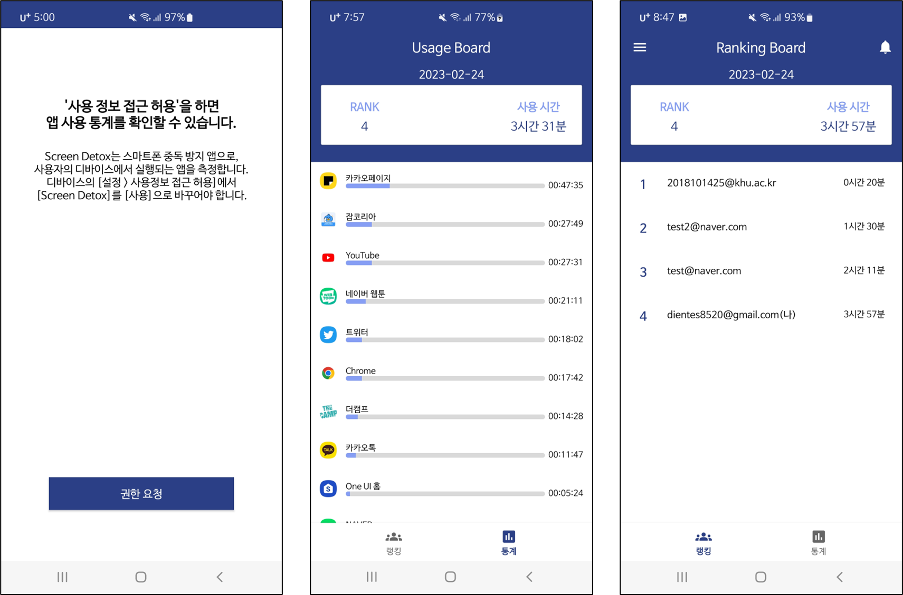

# About

- 친구들과 함께하는 스마트폰 중독 방지 앱
- 개인 프로젝트
- 개발 기간: 2022.10 ~ 2023.02

# Summary

- 스크린 디톡스는 과도한 스크린 타임을 줄이기 위한 앱입니다. 이전에도 스크린 타임을 줄이기 위해 수많은 방법을 시도해 봤습니다. 가장 효과가 좋았던 방법은 친구들과 함께 사용 시간을 줄이는 것이었습니다. 스크린 디톡스는 사용자가 친구들과 서로 스마트폰 사용 시간을 비교하며 스마트폰 사용을 줄이도록 유도합니다.
- [Screen Detox 개선 과정](https://github.com/hamcoding9/ScreenDetox-v2/wiki/Screen-Detox-%EA%B0%9C%EC%84%A0-%EA%B3%BC%EC%A0%95): 스크린 디톡스는 첫 완성 이후 버전2로 개선 과정을 거쳤습니다. Ver2에서 달라진 점을 Wiki에 담았습니다.

# Tech Stack

- 언어: `Kotlin`
- 서버: `Firebase(Auth, Realtime database)`
- 아키텍처: `MVVM`
- 비동기: `Coroutines`
- JetPack: `AAC` `LiveData` `ViewModel` `Navigation` `DataBinding`
- 버전 관리: `Git`
- 디자인: `Figma`

# Features
- **스마트폰 사용 통계 확인**
    - 통계 탭에서 오전 12시 기준 나의 스마트폰 사용 통계를 확인할 수 있습니다.
- **친구들의 스마트폰 사용 랭킹 확인**
    - 랭킹 탭에서 친구의 스마트폰 사용 시간과 순위를 확인할 수 있습니다.
    - 랭킹 탭에서 친구 추가 버튼을 눌러 친구를 추가할 수 있습니다.
    - 랭킹 탭에서 알림 버튼을 눌러 나에게 온 친구 요청을 확인할 수 있습니다. 승인 버튼을 누르면 친구가 되어 랭킹 탭에서 친구의 스마트폰 사용 시간을 볼 수 있습니다.

# What I Learned

- 개발을 체계적으로 관리하기 위해 **버전 관리 시스템** `Git` 배웠고 브랜치를 분리하여 작업하는 방법을 배웠음.
- 중복 코드를 줄이고 기능 확장을 수월하게 하기 위해 **안드로이드 아키텍처**를 공부하였고 `AAC` 를 활용하여 `MVVM` 패턴으로 코드를 설계하였음.
- `Firebase`를 활용하여 사용자 데이터를 관리하고 **Google**과 연동한 `Firebase Auth` 를 활용함.
- **비동기 프로그래밍**을 공부하였고 `Firebase Realtime Database`에 요청한 정보로 View를 업데이트하기 위해 `Coroutine` 을 활용함.
- 필요한 기능에 접근하기 위해 ******안드로이드 권한******을 배웠고 Install-time Permission, Runtime Permission과 다른 **Special Permission**의 대응 방법을 익힘.

# Screenshots

